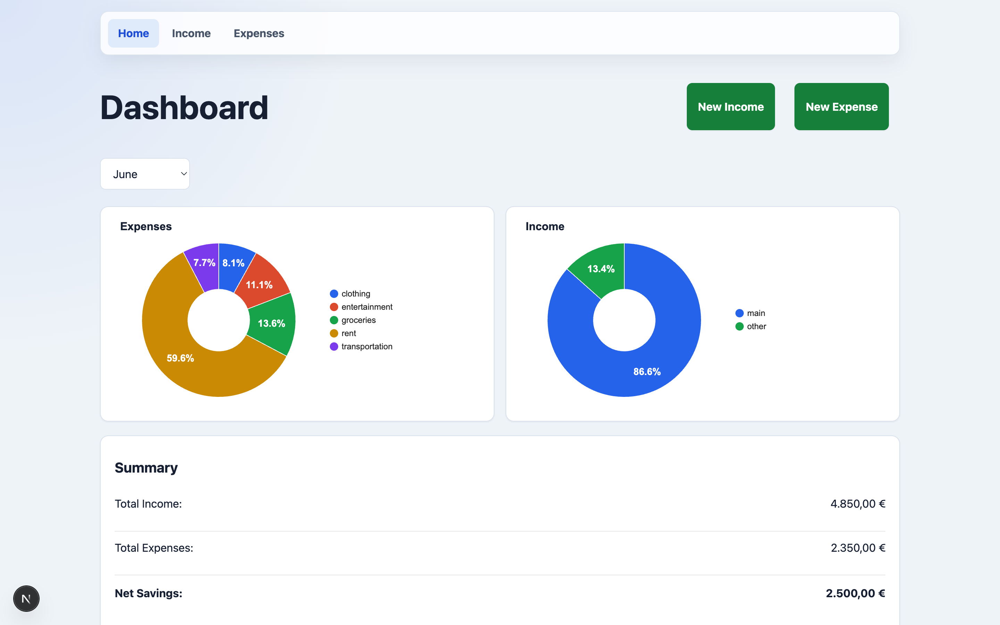
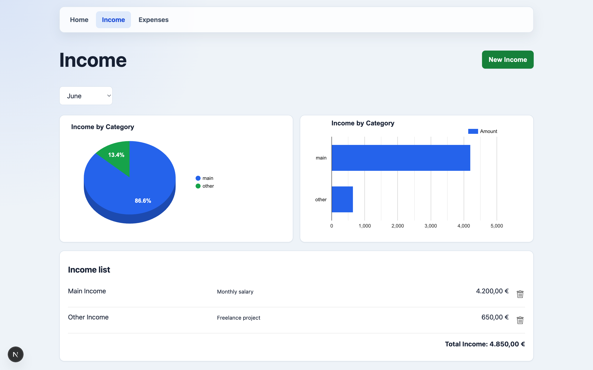
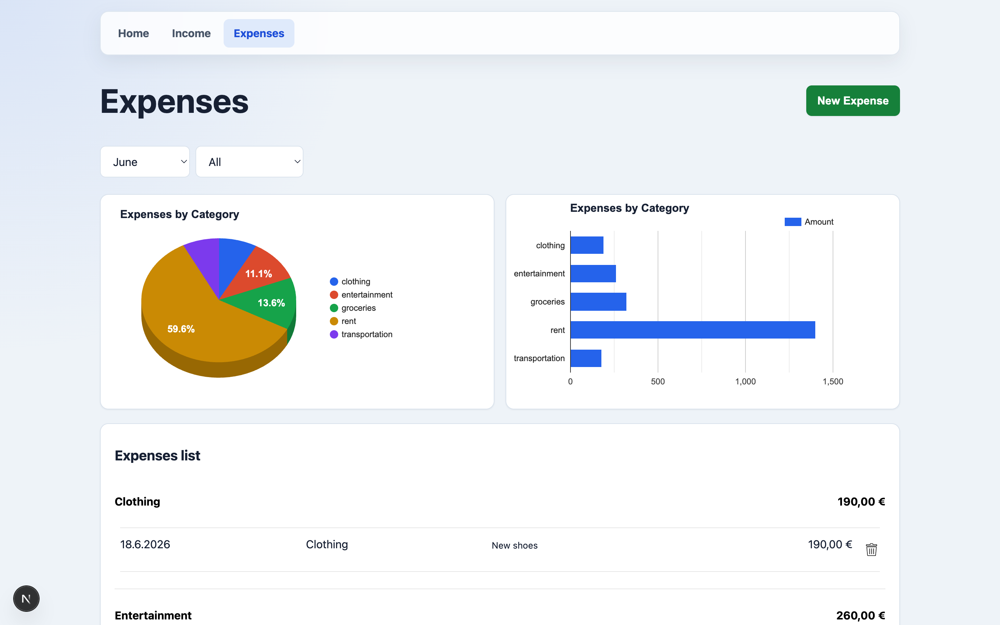

# Expenses Tracker

A small finance tracker for recording monthly income and expenses, filtering by month and category, and reviewing totals with charts.

## Features

- Add income entries by type.
- Add expenses by category.
- Filter income and expenses by month.
- Filter expenses by category.
- Review dashboard totals for income, expenses, and net savings.
- View category breakdowns with charts.

## Getting Started

Install dependencies:

```bash
npm install
```

Start the development server:

```bash
npm run dev
```

Open [http://localhost:3000](http://localhost:3000).

## Screenshots

### Dashboard



### Income



### Expenses


